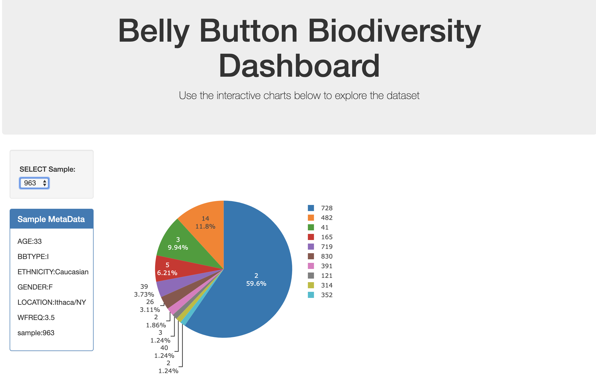
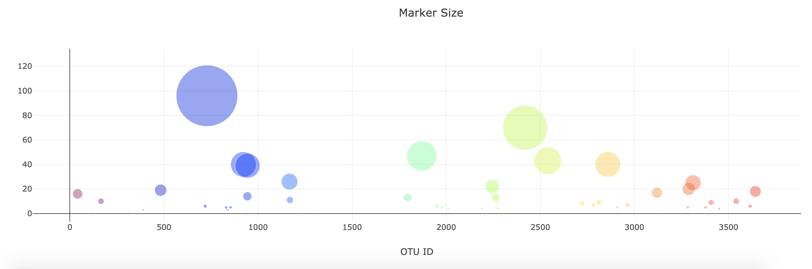

# Belly Button Biodiversity

In this assignment, an interactive dashboard is built to explore the [Belly Button Biodiversity DataSet](http://robdunnlab.com/projects/belly-button-biodiversity/). This study investigated the microbes inhabiting our navels and explored the factors that might influence the microscopic life. 

Plotly.js was used to build interactive charts for the dashboard. Final product is deployed with Heroku at: (https://microbes-biodiversity.herokuapp.com/). 

Example output:

